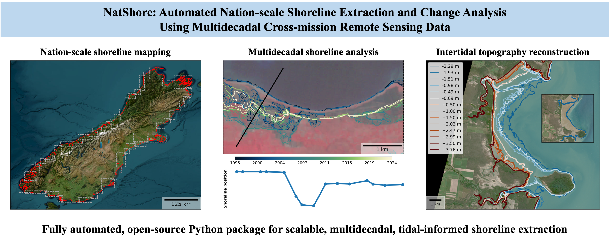

# NatShore

**Nation- to global-scale shoreline extraction and change analysis from multi-mission satellite imagery**

NatShore is an open-source Python framework that automates shoreline mapping and spatio-temporal analysis at large geographic extent. It combines physics-informed spatial units, tide-aware image selection, and a pixel-level confidence measure so that outputs are reproducible, traceable, and suitable for coastal monitoring, hazard assessment, intertidal studies, and policy-relevant shoreline observation.



## Features

- **Automated or predefined regions** — derive analysis bounding boxes from river–shore geometry (`auto_bbox`) or supply predefined boxes (`defined_bbox`, `defined_bbox_wo_ref`).
- **Cross-mission imagery** — tidal stage and cloud/coverage constraints drive selection of suitable scenes; downloads are orchestrated via Google Earth Engine–compatible tooling ([geedim](https://github.com/dugalh/geedim)).
- **Shoreline extraction** — segmentation-based shoreline extraction with tunable parameters (e.g. MACWE iterations and smoothing).
- **Transparency** — configuration is YAML-driven; runs copy the active config into output folders to aid reproducibility.

## Requirements

- **Python** 3.12+ 
- **Google Earth Engine** — a registered GEE project and authenticated client (used for catalog access and downloads).
- **Geospatial stack** — GeoPandas/Shapely, GDAL (via OSGeo bindings or compatible wheels), NumPy/SciPy ecosystem, scikit-image, scikit-learn, PyYAML, and related packages. Versions are pinned in `uv.lock` (see [Installation](#installation)).

## Installation

1. **Install [uv](https://docs.astral.sh/uv/getting-started/installation/)** (standalone installer or package manager; follow the upstream instructions for your OS).

2. **Clone the repository** and install dependencies from the repository root (where `pyproject.toml` and `uv.lock` live):

   ```bash
   cd NatShore
   uv sync
   ```

   This creates a local virtual environment (`.venv/`) and installs the locked dependency set. Use `uv sync --frozen` in CI or when you must reproduce the lockfile exactly.

3. **Earth Engine authentication** — sign in to GEE for your account and project (for example `earthengine authenticate` after dependencies are installed). Helper patterns may live under `natshore/utils/`; ensure your GEE project ID is set wherever the code calls `ee.Initialize`.

**System GDAL:** If `uv sync` fails on GDAL/OSGeo bindings for your platform, install a matching system GDAL stack first, then run `uv sync` again so Python can link against it.

## Running the pipeline

The CLI entry point is `natshore/main.py`. Imports assume the **`natshore` directory is the working directory**. From the repository root, use `uv run` with `--project ..` so the environment from `uv sync` is used:

```bash
cd natshore
uv run --project .. python main.py --config auto_bbox_config.yaml
```

Other bundled configs:

```bash
uv run --project .. python main.py --config pre_defined_config.yaml
uv run --project .. python main.py --config pre_defined_wo_ref_config.yaml
```

Alternatively, activate the project environment once (`source .venv/bin/activate` on Unix, or `.venv\Scripts\activate` on Windows), `cd natshore`, then run `python main.py --config …` as above.

The `--config` argument is the **filename only**; files must live in `natshore/configs/`.

**Stage execution** (which stages run in a given invocation) is controlled by flags near the top of `main.py` (`run_stage1N2A`, `run_stage2B`, `run_stage3`, etc.). Adjust these for your experiment or full production run.

## Configuration

YAML configs in `natshore/configs/` define global settings (`s0`) and stage-specific parameters (`s1`–`s3`), including:

| Stage | Role |
|-------|------|
| **s0** | Mode (`auto_bbox`, `defined_bbox`, `defined_bbox_wo_ref`), data subfolders under `natshore/data/`, years, target IDs, tidal heights |
| **s1** | Bounding-box geometry thresholds and merging behavior (auto mode) |
| **s2A** | Cloud/fill thresholds and retries for image selection |
| **s2B** | Download retries |
| **s3** | MACWE iteration count, smoothing, retries |

Copy and edit a template config for new study areas rather than editing shared defaults in place.

## Data layout

Inputs are expected under `natshore/data/` as referenced in `s0` (e.g. split river linestrings and shoreline polygons under paths such as `Shp_files/splitted_river_linstring` and `Shp_files/splitted_shoreline_polygon`, with per–target-ID naming as used in the code). Outputs and logs are written under run-specific folders derived from year, suffix, mode, and timestamp (see `init_setup` and stage utilities).

## Examples

Demonstration notebooks are under `examples/` (e.g. `1_Single_grid_demo.ipynb`). If Jupyter is included in the uv project (for example as a dev dependency), from the repository root:

```bash
uv run jupyter notebook examples/1_Single_grid_demo.ipynb
```

## Reproducibility

- Commit or archive `uv.lock` with releases; cite the git tag and record `uv sync --frozen` (or the lockfile hash) alongside results.
- Preserve the YAML copied into each run directory together with software versions (Python and key packages) and your GEE project configuration.
- Record random seeds if you add stochastic steps outside the current pipeline.
- For publication, archive a release tag, Zenodo DOI, or supplemental material that pins the exact commit and environment.


## License

This project is released under the [MIT License](LICENSE).

## Contact

For bugs, feature requests, and collaboration, please use the repository’s issue tracker once the code is public, or contact the repo author Isaac Hung (isaacghbk@caece.net).
